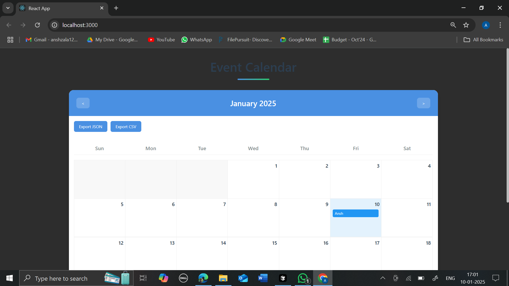
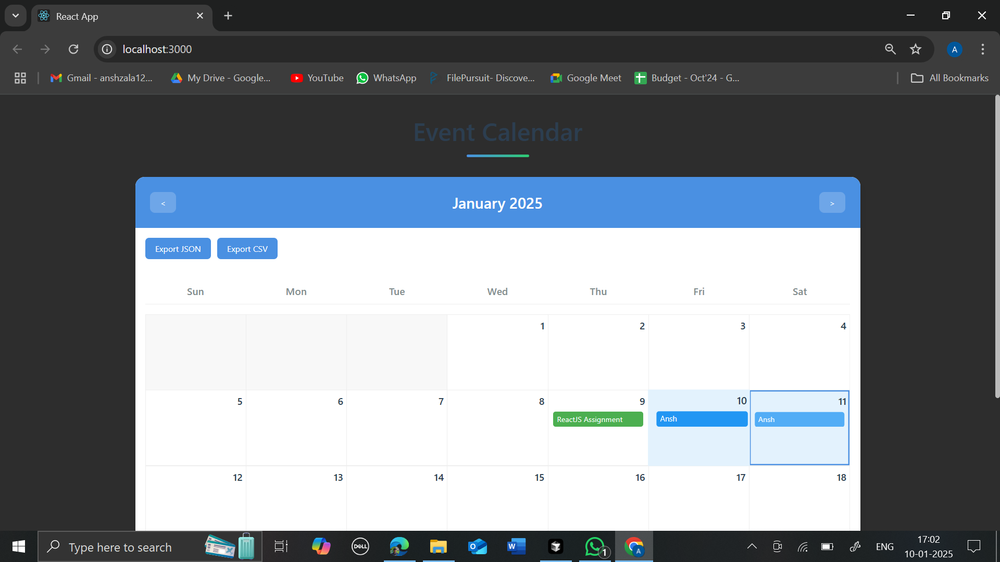
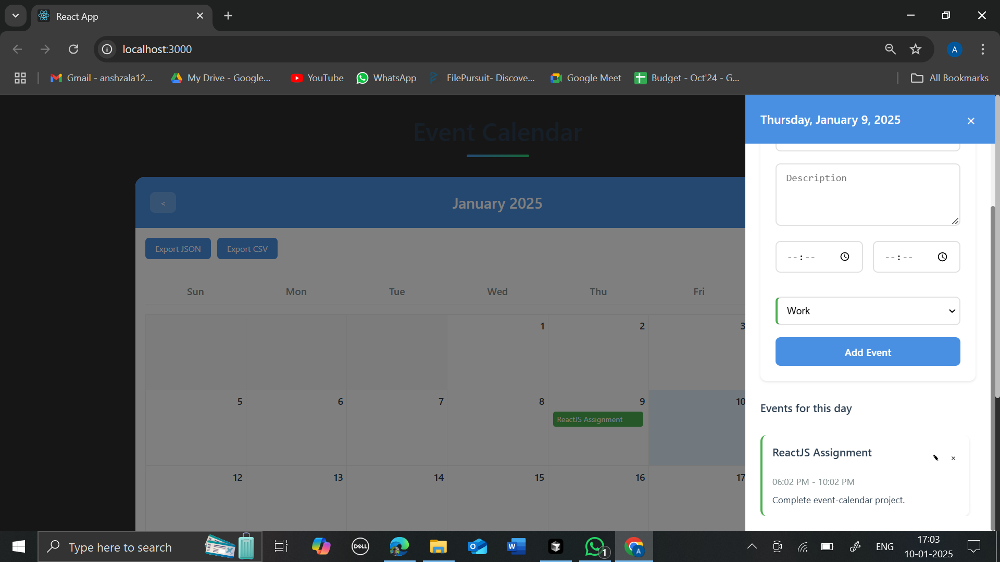
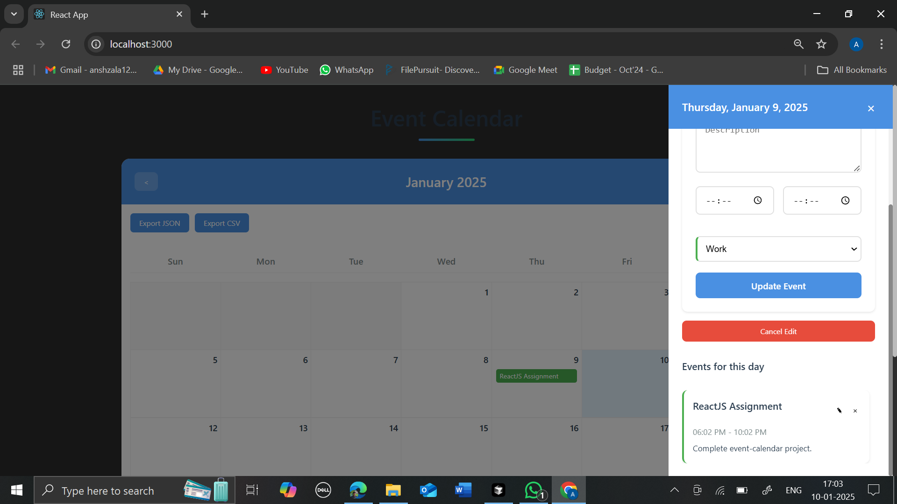

# Calendar App

A modern, intuitive calendar application built with React that helps users manage their daily events and schedules efficiently.

## Features

- Create, edit and delete events
- Categorize events (Work, Personal, Other)
- Time slot management with start and end times
- Event descriptions and details
- Color-coded event categories
- Responsive design for all devices
- Form validation
- Clean and intuitive user interface

## Technologies Used

- React 18
- JavaScript (ES6+)
- CSS3
- ESLint for code linting
- Prettier for code formatting
- Jest for testing
- React Testing Library
- npm for package management

## Setup and Installation

1. Clone the repository:
   ```bash
   git clone https://github.com/yourusername/calendar-app.git
   ```
2. Navigate to project directory:
   ```bash
   cd calendar-app
   ```
3. Install dependencies:
   ```bash
   npm install
   ```
4. Start the development server:
   ```bash
   npm start
   ```
5. Open http://localhost:3000 in your browser

## Development Guidelines

1. Follow the ESLint configuration
2. Run tests before submitting PRs
3. Format code using Prettier
4. Follow React best practices

## Screenshots

### Calendar View


### Event Creation Form


### List of Events


### Edit Event Form


## Author Details

- **Name:** Ansh Zala
- **Email:** anshzala20@gmail.com
- **LinkedIn:** [linkedin.com/in/anshzala](https://www.linkedin.com/in/anshzala)
- **Portfolio:** [https://anshzala.github.io/AnshZala-Portfolio/](https://anshzala.github.io/AnshZala-Portfolio/)

Feel free to reach out for any questions or collaboration opportunities!